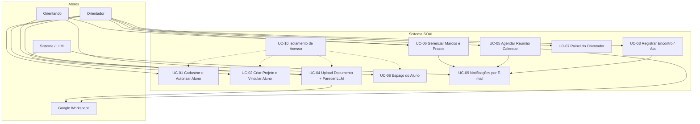
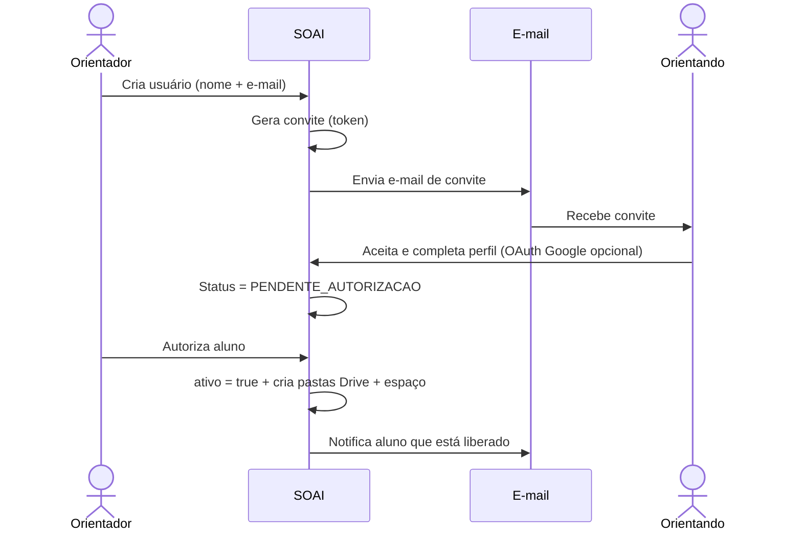
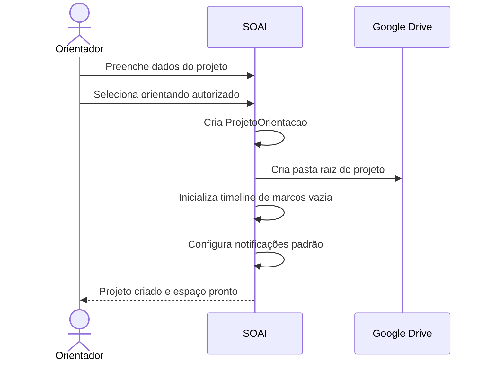
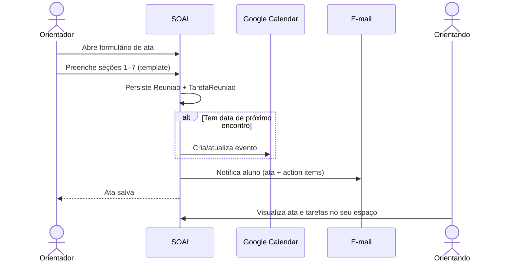
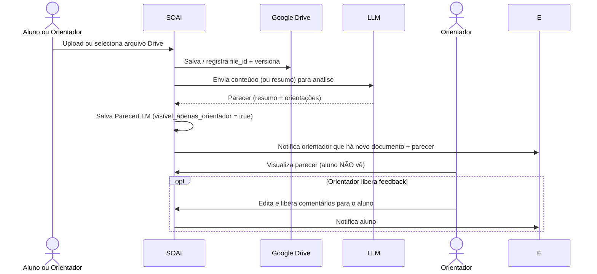
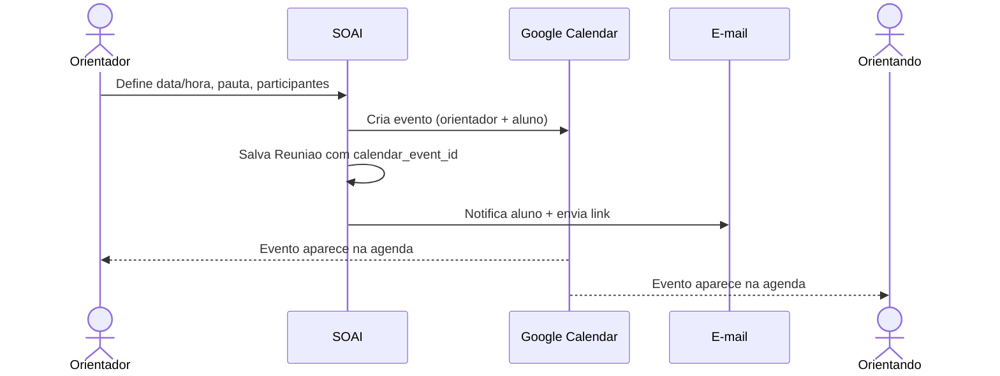
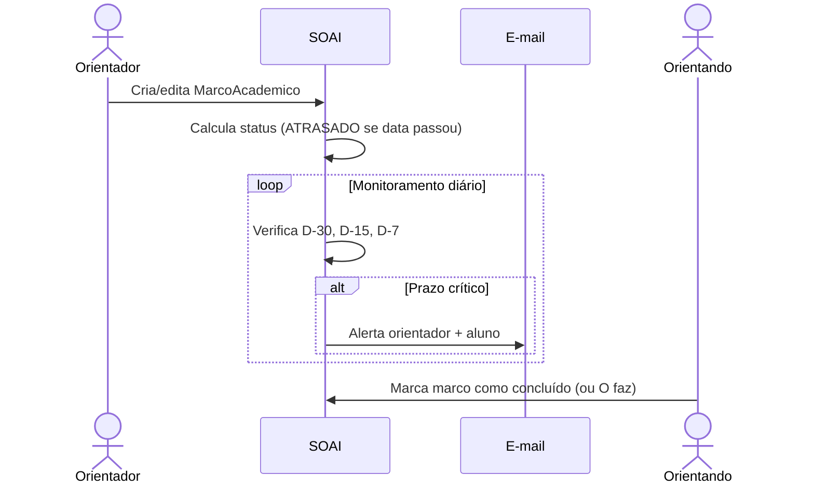
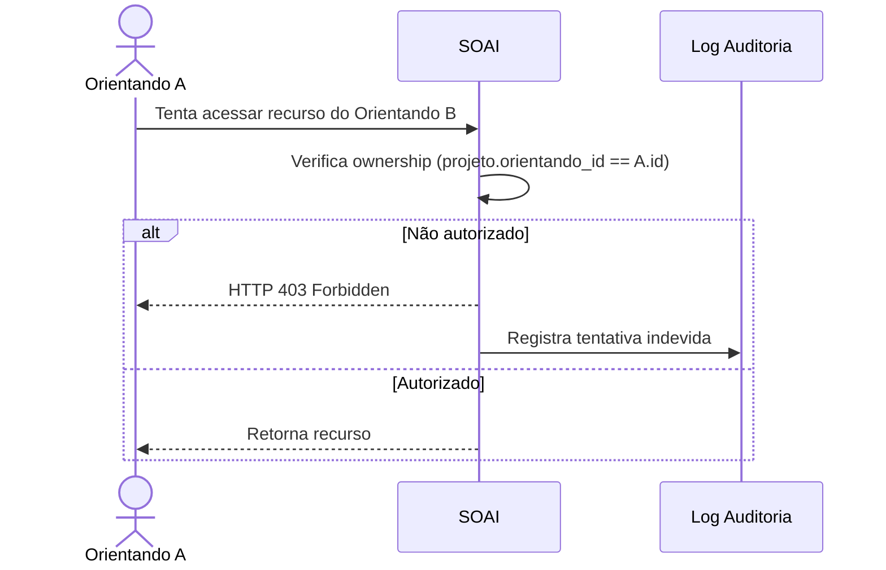

# PRD — Sistema de Orientação Acadêmica Inteligente (SOAI)

**Versão:** 1.0  
**Data:** 17/08/2026  
**Autor:** Orientador (uso pessoal)  
**Escopo inicial:** Sistema pessoal para gestão dos seus orientandos (IC, TCC, Mestrado, Doutorado, Pós-Doc)  
**Plataforma de desenvolvimento recomendada:** Google Antigravity 2.0 + Skills customizadas  

---

## 1. Visão do Produto

### 1.1 Problema
A comunicação e os artefatos da orientação acadêmica ficam fragmentados entre e-mails, WhatsApp, Google Drive disperso, Docs soltos e ausência de rastreabilidade clara de decisões, prazos e feedbacks. O orientador perde tempo e o aluno não tem visibilidade clara do que foi acordado e do que precisa entregar.

### 1.2 Solução
Uma plataforma **pessoal** (single-tenant do orientador) que centraliza:

- Cadastro e autorização de orientandos
- Projetos de pesquisa vinculados a cada aluno
- Registro estruturado de encontros (baseado no template de ata)
- Marcos e prazos (capítulos, revisões, apresentações, checklists, qualificação, defesa…)
- Repositório versionado de documentos com parecer automático de LLM (visível só ao orientador)
- Integração nativa com Google Calendar, Drive, Docs e Sheets
- Notificações por e-mail sincronizadas

### 1.3 Princípios de Design
1. **Orientador-first**: você controla tudo; o aluno vê apenas o seu espaço.
2. **Mínima fricção**: registro de ata em < 2 minutos.
3. **Google Workspace como fonte da verdade** para arquivos e agenda.
4. **Parecer LLM privado**: o aluno nunca vê o resumo/recomendações geradas pela IA.
5. **Escopo pessoal primeiro**: multi-aluno sob o mesmo orientador; sem multi-instituição nesta versão.

---

## 2. Atores

| Ator            | Descrição                                      | Permissões principais                          |
|-----------------|------------------------------------------------|------------------------------------------------|
| Orientador      | Você (dono do sistema)                         | CRUD total, autorização de alunos, pareceres   |
| Orientando      | Seu aluno (IC/TCC/Mestrado/Doutorado/Pós-Doc)   | Acesso exclusivo ao próprio espaço             |
| Sistema / LLM   | Agente de parecer e notificações               | Gera parecer, dispara e-mails, sincroniza Google |
| Google Workspace| Calendar, Drive, Docs, Sheets                  | Armazenamento e agenda externos                |

---

## 3. Requisitos Funcionais

### RF-01 — Gestão de Usuários e Autorização
- CRUD completo de usuários.
- Papéis: `ORIENTADOR` | `ORIENTANDO`.
- O orientador **autoriza explicitamente** cada aluno antes de ele acessar o sistema.
- Autenticação preferencial via Google OAuth ou Magic Link por e-mail.
- Um orientando nunca visualiza dados de outro.

### RF-02 — Cadastro de Projeto de Pesquisa
- Orientador cria o projeto e vincula a um aluno já autorizado.
- Campos: título, pergunta de pesquisa vigente, nível acadêmico, programa, data de início, prazo limite de defesa, status.
- Ao vincular, o sistema cria automaticamente:
  - Espaço do aluno
  - Pastas padrão no Google Drive
  - Timeline de marcos vazia
  - Configuração de notificações

### RF-03 — Marcos e Datas (CRUD completo)
Tipos de marco suportados (extensível):
- Data de escrita de capítulo
- Data de apresentação
- Data de revisão
- Data de checklist
- Data de qualificação
- Data de defesa
- Submissão de artigo / edital
- Marcos personalizados

Cada marco possui: título, descrição, data prevista, data de conclusão, status (`A_FAZER` | `EM_REVISAO` | `CONCLUIDO` | `ATRASADO`), responsável.

### RF-04 — Registro de Encontro de Orientação (Ata)
Formulário estruturado fiel ao template anexo:

1. Cabeçalho (nº do encontro, data, versão do material, participantes, pergunta vigente, produto em desenvolvimento, situação do cronograma Verde/Amarelo/Vermelho)
2. Síntese do avanço desde o encontro anterior
3. Decisões tomadas (com justificativa e impacto)
4. Questões críticas e riscos (dimensão, nível de risco, mitigação, data de revisão)
5. Plano de trabalho até o próximo encontro (tarefas com responsável e prazo)
6. Perguntas que devem orientar a próxima entrega
7. Próximo encontro (data/hora, material a enviar com 72h de antecedência, 3 decisões a destravar, critério de aceite)

### RF-05 — Repositório de Documentos + Versionamento + Parecer LLM
- Upload ou link direto do Google Drive / Docs / Sheets.
- Versionamento automático.
- Categorias: MANUSCRITO, CAPITULO, PLANO_ORIENTACAO, PLANO_PESQUISA, DATASET, PARECER_ETICA, SLIDES, OUTRO.
- **Parecer LLM** gerado automaticamente (resumo + o que orientar nas próximas etapas).
- Parecer **visível exclusivamente ao orientador**.
- Comentários manuais do orientador também suportados.

### RF-06 — Integração Google Calendar
- Criação de eventos de reunião (individual ou grupo).
- Inserção de pauta e próximos passos na descrição do evento.
- Lembretes (24h e 1h).
- Sincronização bidirecional básica.

### RF-07 — Notificações por E-mail
- Toda ação relevante notifica o orientando (e opcionalmente o orientador).
- Exemplos: nova reunião, novo documento, prazo se aproximando (D-30/D-15/D-7), tarefa atribuída, status de marco alterado, feedback liberado.

### RF-08 — Painéis
- **Painel do Orientador**: visão global de todos os alunos, status de cronograma, alertas, acesso rápido a atas e pareceres.
- **Espaço do Aluno**: timeline, repositório, atas, tarefas pendentes, prazos.

### RF-09 — Segurança e Isolamento
- RBAC estrito.
- Tentativa de acesso cruzado → HTTP 403 + log de auditoria.

---

## 4. Requisitos Não-Funcionais

| ID     | Categoria     | Requisito                                              |
|--------|---------------|--------------------------------------------------------|
| RNF-01 | Segurança     | Isolamento total entre alunos + RBAC                   |
| RNF-02 | Privacidade   | LGPD; parecer LLM nunca exposto ao aluno               |
| RNF-03 | Usabilidade   | Registro de ata < 2 min; SUS > 80                      |
| RNF-04 | Integração    | OAuth2 Google (Calendar, Drive, Docs, Sheets)          |
| RNF-05 | Performance   | Arquivos até 100 MB; checksum                          |
| RNF-06 | Auditoria     | Log imutável de ações sensíveis                        |
| RNF-07 | Confiabilidade| Fila de e-mails com retry                              |
| RNF-08 | Escopo        | Single-tenant (um orientador) na v1                    |

---

## 5. Modelo de Dados (Entidades)

```text
Usuario
├── id (UUID)
├── nome
├── email (único)
├── papel (ORIENTADOR | ORIENTANDO)
├── google_id (opcional)
├── ativo (bool)          # orientador autoriza
├── avatar_url
└── created_at / updated_at

ProjetoOrientacao
├── id
├── orientador_id (FK)
├── orientando_id (FK)
├── titulo
├── pergunta_pesquisa
├── nivel (IC | TCC | MESTRADO | DOUTORADO | POS_DOC)
├── programa
├── data_inicio
├── prazo_defesa
├── status (EM_ANDAMENTO | QUALIFICADO | DEFENDIDO | TRANCADO)
└── drive_folder_id

MarcoAcademico
├── id
├── projeto_id
├── titulo
├── tipo (CAPITULO | APRESENTACAO | REVISAO | CHECKLIST | QUALIFICACAO | DEFESA | SUBMISSAO | OUTRO)
├── descricao
├── data_prevista
├── data_conclusao
├── status
└── responsavel_id

Reuniao
├── id
├── projeto_id
├── numero_encontro
├── data_hora_inicio
├── data_hora_fim
├── link_videoconferencia
├── versao_material
├── participantes (json)
├── pergunta_vigente
├── produto_em_desenvolvimento
├── situacao_cronograma (VERDE | AMARELO | VERMELHO)
├── sintese_avanco (json)
├── decisoes (json)
├── riscos (json)
├── plano_trabalho (json)
├── perguntas_proxima_entrega (json)
├── proximo_encontro (json)
├── ata_resumo
├── calendar_event_id
└── status (AGENDADA | REALIZADA | CANCELADA)

TarefaReuniao
├── id
├── reuniao_id
├── responsavel_id
├── descricao
├── prazo
└── concluida

Documento
├── id
├── projeto_id
├── categoria
├── titulo
├── versao
├── drive_file_id / local_path
├── tamanho_bytes
├── checksum
├── comentarios_orientador
├── enviado_por
└── created_at

ParecerLLM
├── id
├── documento_id
├── resumo
├── pontos_fortes
├── lacunas
├── orientacoes_proximas_etapas
├── modelo_usado
└── gerado_em
```

---

## 6. Diagramas de Casos de Uso

### 6.1 Diagrama Geral (Visão de Atores)



### 6.2 UC-01 — Cadastrar e Autorizar Aluno



### 6.3 UC-02 — Criar Projeto e Vincular Aluno



### 6.4 UC-03 — Registrar Encontro de Orientação (Ata)



### 6.5 UC-04 — Upload de Documento + Parecer LLM



### 6.6 UC-05 — Agendar Reunião com Google Calendar



### 6.7 UC-06 — Gerenciar Marcos e Alertas de Prazo



### 6.8 UC-10 — Isolamento de Acesso (Regra de Segurança)



---

## 7. Arquitetura Técnica Detalhada

### 7.1 Visão de Alto Nível

```text
┌─────────────────────────────────────────────────────────────────┐
│                     Frontend (Next.js 15 + React)               │
│  Painel Orientador  |  Espaço do Aluno  |  Formulário de Ata    │
└────────────────────────────┬────────────────────────────────────┘
                             │ HTTPS / REST + Server Actions
┌────────────────────────────▼────────────────────────────────────┐
│                     Backend (Next.js API Routes                 │
│                     ou NestJS / FastAPI)                        │
│  Auth (NextAuth / Lucia)  |  RBAC  |  Services  |  Jobs         │
└──────┬─────────────┬──────────────┬─────────────┬───────────────┘
       │             │              │             │
       ▼             ▼              ▼             ▼
┌────────────┐ ┌──────────┐ ┌──────────────┐ ┌──────────────────┐
│ PostgreSQL │ │ Redis    │ │ Google APIs  │ │ LLM (Gemini /    │
│ + JSONB    │ │ (filas)  │ │ Calendar     │ │  Claude / GPT)   │
│            │ │          │ │ Drive/Docs   │ │                  │
│            │ │          │ │ Sheets       │ │                  │
└────────────┘ └──────────┘ └──────────────┘ └──────────────────┘
```

### 7.2 Stack Recomendada (v1 — uso pessoal)

| Camada              | Tecnologia                          | Justificativa                                      |
|---------------------|-------------------------------------|----------------------------------------------------|
| Frontend            | Next.js 15 (App Router) + Tailwind + shadcn/ui | Rápido de desenvolver, SSR, Server Actions         |
| Backend             | Next.js API Routes ou NestJS        | Unificado ou separado conforme complexidade        |
| Banco de dados      | PostgreSQL (Neon / Supabase / local)| Relacional + JSONB para atas e pareceres           |
| Auth                | NextAuth.js (Google + Magic Link) ou Lucia | OAuth Google nativo + e-mail                       |
| Filas / Jobs        | BullMQ + Redis ou Inngest / Trigger.dev | Notificações, alertas de prazo, geração de parecer |
| Armazenamento       | Google Drive (principal) + S3 opcional | Você já usa Drive; evita duplicar arquivos         |
| LLM                 | Gemini 2.5 / 3.x (via Google AI) ou Claude | Parecer de documentos acadêmicos                   |
| E-mail              | Resend / Nodemailer + Gmail API     | Notificações confiáveis                            |
| Deploy              | Vercel (frontend + API) + Neon      | Ideal para sistema pessoal                         |

### 7.3 Integrações Google Workspace

**Escopos OAuth necessários (mínimos):**
- `https://www.googleapis.com/auth/calendar.events`
- `https://www.googleapis.com/auth/drive.file` (ou `drive` se precisar listar)
- `https://www.googleapis.com/auth/documents`
- `https://www.googleapis.com/auth/spreadsheets`

**Fluxo de autenticação Google:**
1. Orientador conecta sua conta Google uma vez (OAuth).
2. Tokens são armazenados de forma segura (criptografados).
3. Para cada aluno, eventos e pastas são criados usando a conta do orientador (ou shared drives).
4. Alunos podem conectar suas próprias contas Google (opcional) para receber eventos na agenda pessoal.

### 7.4 Fluxo de Parecer LLM

1. Documento chega (upload ou Drive).
2. Job assíncrono extrai texto (pdf-parse, mammoth para docx, ou Google Docs API).
3. Prompt estruturado enviado ao LLM:
   - Resumo executivo (máx. 150 palavras)
   - Pontos fortes
   - Lacunas / riscos acadêmicos
   - Orientações concretas para as próximas 2–3 etapas
4. Resultado salvo em `ParecerLLM` com flag `visivel_apenas_orientador = true`.
5. Orientador é notificado.

### 7.5 Estrutura de Pastas no Google Drive (por projeto)

```text
SOAI - [Nome do Aluno] - [Título curto do projeto]/
├── 00 - Plano de Orientação
├── 01 - Plano de Pesquisa
├── 02 - Capítulos e Manuscritos
├── 03 - Atas de Reunião
├── 04 - Dados e Scripts
├── 05 - Ética e Autorizações
└── 06 - Apresentações e Slides
```

### 7.6 Segurança (v1)

- RBAC em todas as rotas (middleware).
- Verificação de ownership em **todo** recurso (`projeto.orientando_id === session.user.id` ou é orientador).
- Tokens Google criptografados em repouso.
- Logs de auditoria para ações sensíveis (upload, download, autorização, tentativa 403).
- HTTPS obrigatório.
- Rate limiting básico nas APIs públicas.

---

## 8. Casos de Teste Prioritários (v1)

| Código     | Caso                                      | Resultado Esperado                                      |
|------------|-------------------------------------------|---------------------------------------------------------|
| CT-01      | Orientador autoriza aluno                 | Aluno consegue logar e vê apenas seu espaço             |
| CT-02      | Aluno tenta acessar dados de outro        | HTTP 403 + log                                          |
| CT-03      | Registro de ata completo                  | Todas as seções salvas + e-mail enviado                 |
| CT-04      | Upload de documento                       | Versionado + parecer LLM gerado (só orientador vê)      |
| CT-05      | Agendamento de reunião                    | Evento criado no Calendar de ambos + notificação        |
| CT-06      | Marco com prazo em 7 dias                 | Alerta automático disparado                             |
| CT-07      | Isolamento multi-aluno                    | Zero vazamento de dados entre alunos                    |

---

## 9. Roadmap de Implementação (4 sprints — uso pessoal)

**Sprint 1 — Fundação**
- Auth (Google + Magic Link)
- CRUD de usuários + autorização do orientador
- Modelo de dados + migrations
- Painel básico do orientador e espaço do aluno

**Sprint 2 — Core de Orientação**
- CRUD de Projetos
- Formulário completo de Ata (template)
- Marcos e timeline
- Notificações por e-mail

**Sprint 3 — Google + Documentos**
- Integração Google Calendar
- Integração Google Drive / Docs / Sheets
- Upload + versionamento
- Geração de parecer LLM

**Sprint 4 — Polimento e Uso Real**
- Alertas de prazo
- Painel consolidado com status Verde/Amarelo/Vermelho
- Ajustes de UX com base no uso real com seus alunos
- Logs de auditoria e hardening de segurança

---

## 10. Ativação de Skills no Antigravity

Ao abrir este projeto no Antigravity, ative / instale as seguintes skills:

```bash
# Skills recomendadas
npx antigravity-awesome-skills --antigravity

# Ou instale seletivamente:
# fullstack-architect, backend-engineer, frontend-specialist
# api-designer, database-expert, security-engineer
# test-engineer
```

**Skill customizada obrigatória deste projeto:**  
`academic-orientation-system` (arquivo `SKILL.md` abaixo).

Coloque-a em:
- Global: `~/.gemini/antigravity/skills/academic-orientation-system/SKILL.md`
- Ou workspace: `.agent/skills/academic-orientation-system/SKILL.md`

---

## 11. Critérios de Aceite da v1 (Uso Pessoal)

- [ ] Você consegue cadastrar e autorizar seus alunos
- [ ] Cada aluno vê apenas o próprio espaço
- [ ] Você registra uma ata completa em menos de 2 minutos
- [ ] Documentos sobem para o Drive e geram parecer LLM privado
- [ ] Reuniões aparecem no Google Calendar
- [ ] E-mails de notificação chegam consistentemente
- [ ] Status do cronograma (Verde/Amarelo/Vermelho) é visível no seu painel
- [ ] Zero vazamento de dados entre orientandos

---

**Fim do PRD v1.0**  
Este documento é a fonte da verdade para o desenvolvimento no Antigravity.
